# NEXUS — System Design

## Overview

NEXUS is a decentralized, peer-to-peer encrypted file ownership platform. There are no central servers that hold your data. Files are encrypted locally, split into content-addressed shards, and transferred directly between peers using libp2p networking.

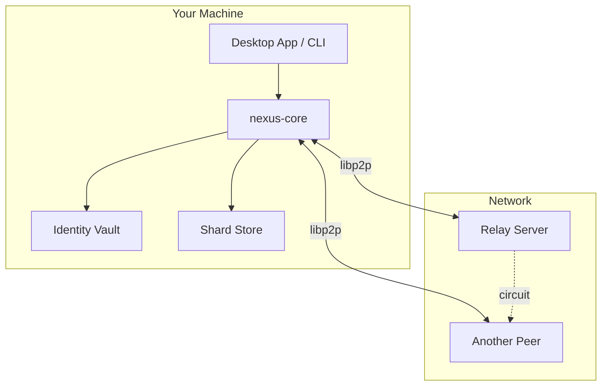

---

## Core Components

### 1. Identity (`nexus-core/src/identity/`)

Every user has a cryptographic identity — no usernames, no passwords, no accounts on someone else's server.

| Component | Purpose |
|-----------|---------|
| **IdentityKeypair** | Ed25519 signing keypair — your "ID card" |
| **DID** | Decentralized Identifier: `did:key:z6Mk...` derived from your public key |
| **PeerId** | libp2p network identifier (also derived from your keypair) |
| **IdentityVault** | Encrypted on-disk storage of your keypair (passphrase-protected via Argon2) |

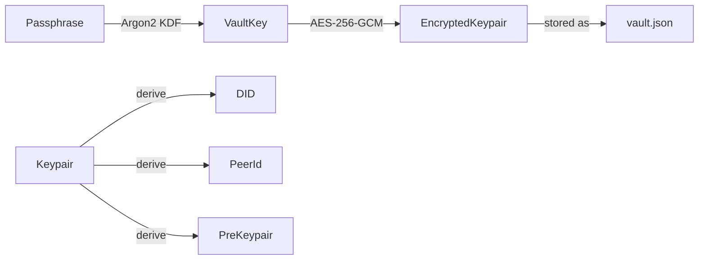

**Your DID is your identity.** Anyone who knows your DID can encrypt files for you, verify your signatures, or find you on the network. You never hand over credentials to anyone.

---

### 2. Encryption (`nexus-core/src/crypto/`)

NEXUS uses a two-layer encryption scheme:

#### Layer 1: Symmetric (AES-256-GCM)
- A random **Data Encryption Key (DEK)** is generated per file
- The file body is encrypted with this DEK
- Fast, handles any file size

#### Layer 2: Proxy Re-Encryption (Umbral PRE)
- The DEK itself is encrypted under your PRE public key (key encapsulation)
- Only you can decrypt it... unless you **delegate access**

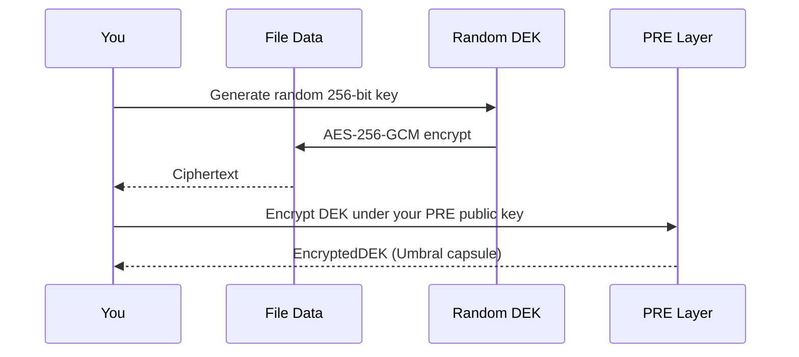

**Why two layers?** So you can share access to a file without decrypting it or re-encrypting it. You generate **kfrags** (key fragments) that let the recipient reconstruct the DEK. The actual file data never moves through any proxy.

---

### 3. Storage (`nexus-core/src/storage/`)

Files aren't stored as blobs — they're **sharded** into content-addressed chunks.

#### Sharding Process

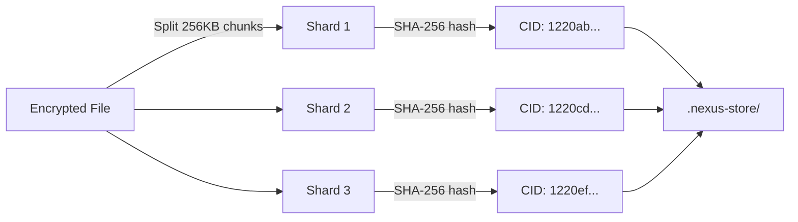

| Component | Purpose |
|-----------|---------|
| **Shard** | 256KB chunk of encrypted data, identified by its CID (content hash) |
| **CID** | SHA2-256 multihash of the shard bytes — guarantees integrity |
| **ShardStore** | On-disk directory (`.nexus-store/`) that maps CID → bytes |
| **ShardManifest** | List of CIDs in order — the "recipe" to reassemble the file |

**Content-addressing means:**
- Identical data produces identical CIDs (deduplication)
- Any corruption is instantly detectable (hash doesn't match)
- Shards are self-verifying — no trust required between peers

---

### 4. Manifests (`nexus-core/src/manifest.rs`)

A **manifest** (`.nexus` file) is the metadata that ties everything together:

```json
{
  "owner": "did:key:z6Mk...",
  "owner_pre_pk": { "bytes": "..." },
  "shards": {
    "filename": "report.pdf",
    "total_size": 1048576,
    "shard_size": 262144,
    "shards": ["1220ab...", "1220cd...", "1220ef...", "1220gh..."]
  },
  "encrypted_dek": {
    "capsule": "...",
    "ciphertext": "..."
  }
}
```

The manifest is small (< 1 KB typically). It's what you send to someone to give them *access* — without sending the actual file data.

---

### 5. Sharing via Proxy Re-Encryption

This is the magic of NEXUS. You can share a file with someone **without decrypting it** and **without trusting any server**.

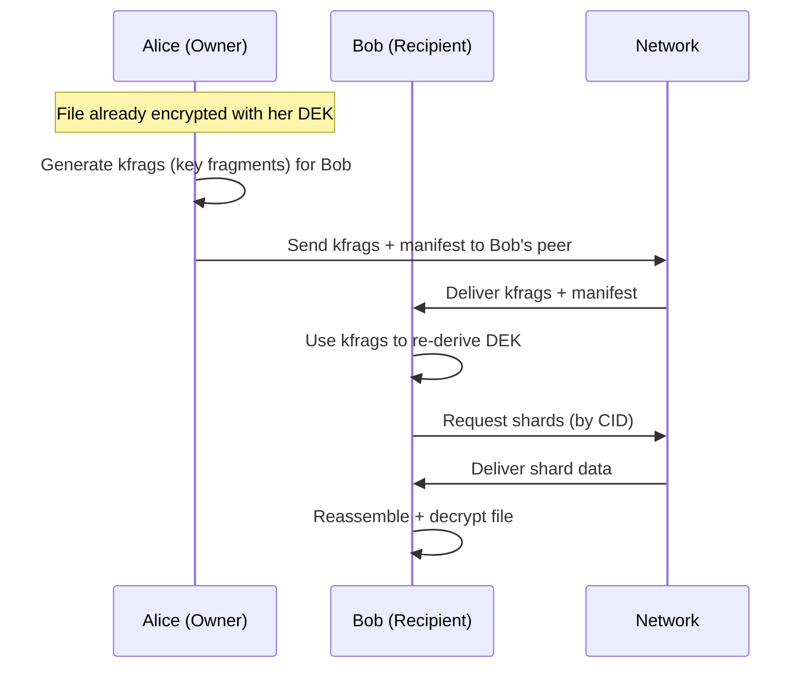

#### The PRE Flow in Detail

1. **Alice** has an encrypted file (DEK wrapped in her Umbral capsule)
2. **Alice** generates **kfrags** — these let Bob transform the capsule without seeing the DEK
3. **Alice** sends Bob: manifest + kfrags + share grant
4. **Bob** uses kfrags to produce **cfrags** (capsule fragments)
5. **Bob** combines cfrags to "open" the capsule and recover the DEK
6. **Bob** decrypts the file with the DEK

**No proxy server needed.** The "proxy" in "proxy re-encryption" refers to the math — anyone holding kfrags can transform the capsule for Bob, but they never learn the DEK.

---

## Networking (`nexus-core/src/network/`)

### Architecture

Every NEXUS peer runs a **libp2p swarm** — a multiplexed network node that speaks multiple protocols simultaneously:

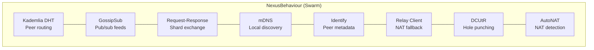

### Protocol Purposes

| Protocol | What It Does | When It's Used |
|----------|-------------|----------------|
| **mDNS** | Broadcasts on local network to find peers | Always (LAN discovery) |
| **Kademlia (DHT)** | Distributed hash table for peer routing | Finding peers by PeerId across the internet |
| **GossipSub** | Pub/sub messaging | Feed updates, presence announcements |
| **Request-Response** | Direct message exchange | Shard transfer, manifest push, kfrag delivery, ping |
| **Identify** | Exchange peer metadata on connect | Every new connection |
| **AutoNAT** | Probe reachability from outside | Periodic (every 60s retry, 300s refresh) |
| **Relay Client** | Connect to relay for NAT traversal | When behind NAT |
| **DCUtR** | Upgrade relayed connection to direct | After relay connection established |

---

### What is a Node?

A **node** is your running NEXUS process connected to the p2p network. It:

1. **Listens** on TCP + QUIC ports for incoming connections
2. **Discovers** peers via mDNS (local) or DHT (global)
3. **Serves shards** — responds to `GetShard` requests with data from your store
4. **Receives shards** — accepts `PushShard` messages from senders
5. **Handles sharing** — receives manifests, kfrags, and share grants

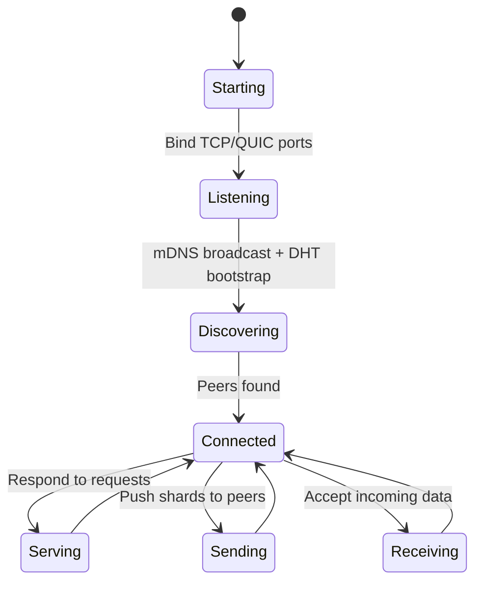

**You need a node running to:**
- Send or receive files
- Be discoverable by other peers
- Participate in the network at all

---

### What is a Relay?

A **relay** is just a regular NEXUS node running on a machine with a **public IP address**. It solves one problem: **NAT traversal**.

#### The NAT Problem

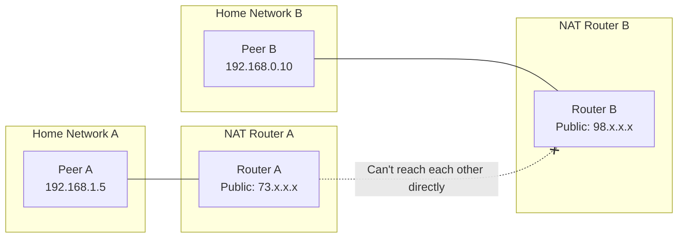

Most home/office networks use NAT — your device has a private IP (192.168.x.x) behind a router. Two NATted peers can't connect directly because neither knows the other's actual address.

#### How the Relay Solves This

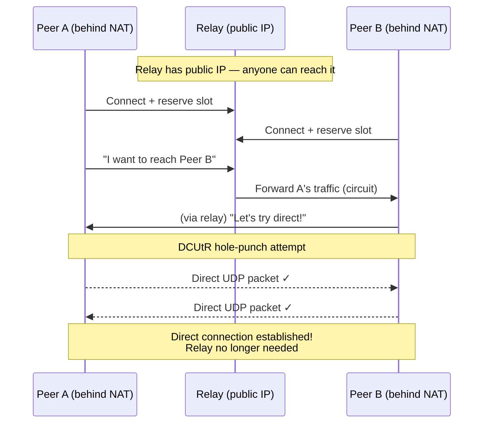

#### Relay Lifecycle

1. **Reservation** — Your node connects to the relay and says "I'm here, route traffic to me." The relay reserves a slot.
2. **Circuit** — When another peer wants to reach you, they connect through the relay's circuit address: `/ip4/RELAY_IP/tcp/PORT/p2p/RELAY_ID/p2p-circuit/p2p/YOUR_ID`
3. **Upgrade (DCUtR)** — Once both peers are connected via relay, DCUtR coordinates a **hole-punch**: both peers simultaneously send UDP packets to each other, punching through their NATs.
4. **Direct** — If hole-punch succeeds, traffic flows directly. If not, relay continues forwarding (slower but functional).

#### Why Not Just Use a Server?

| Approach | Data Privacy | Single Point of Failure | Scales |
|----------|-------------|------------------------|--------|
| **Central server** | Server sees everything | Yes | Needs money |
| **NEXUS relay** | Relay sees nothing (encrypted) | Can use multiple relays | Relay is lightweight |

The relay never sees your file data — it only forwards opaque encrypted packets. You can run multiple relays for redundancy. Anyone can run a relay.

---

### NAT Traversal — The Full Flow

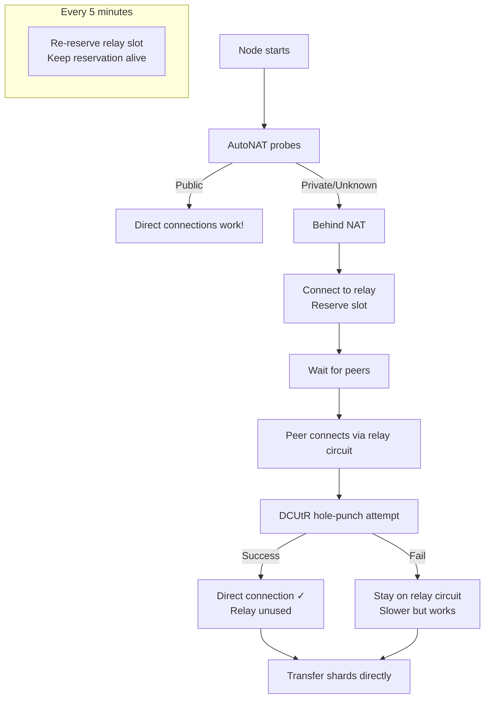

---

### Wire Protocol

NEXUS uses a custom request-response protocol (`/nexus/1.0.0`) for all data exchange:

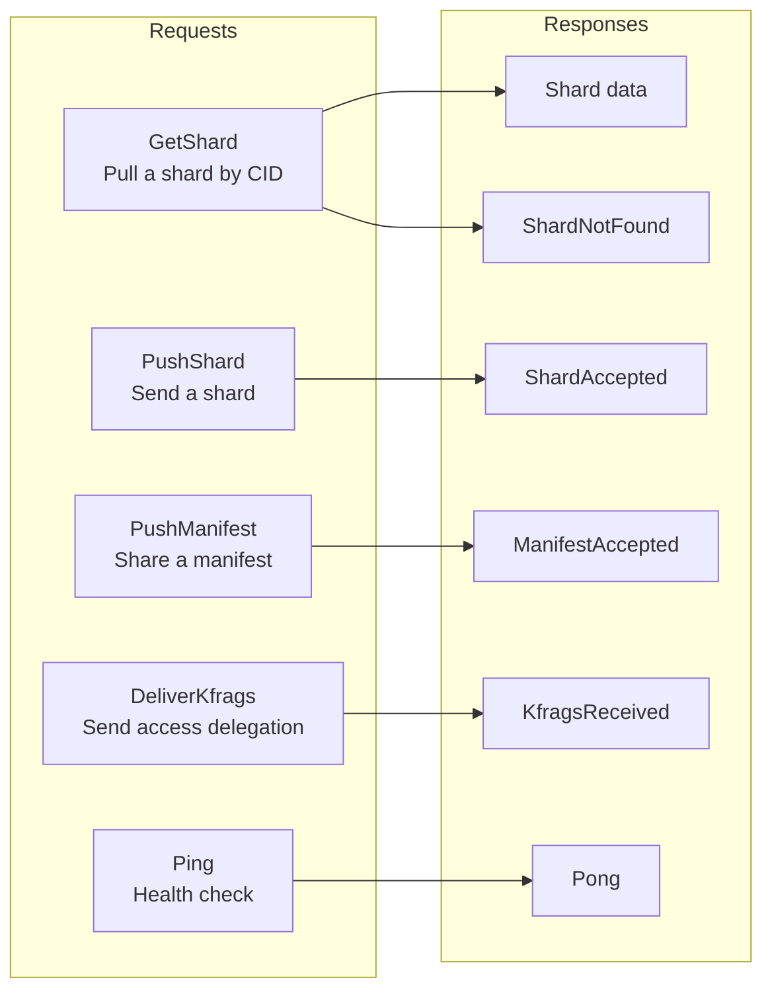

Messages are length-prefixed JSON (4-byte big-endian length + JSON payload). Max message size: 16 MB.

---

## Complete File Transfer Flow

### Sending a File

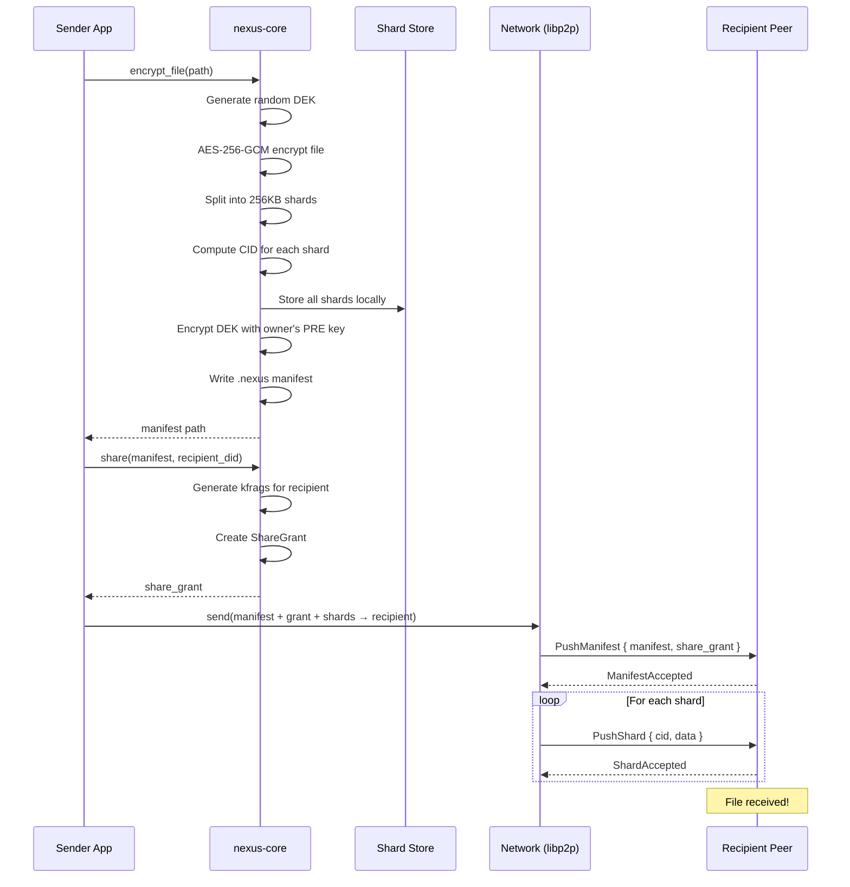

### Receiving & Decrypting a Shared File

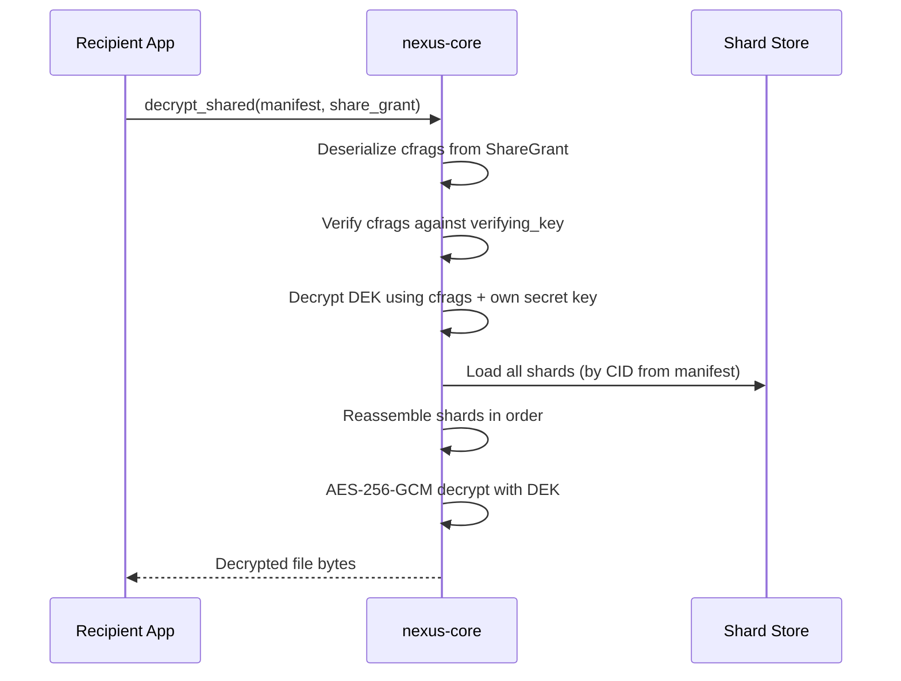

---

## Send Queue & Retry Logic

When a recipient is offline, sends are queued locally:

```mermaid
stateDiagram-v2
    [*] --> Pending: Enqueue send
    Pending --> InProgress: Peer reachable, attempt delivery
    InProgress --> Delivered: All shards + manifest accepted
    InProgress --> Pending: Failed, retry later

    Pending --> Failed: 5 attempts exhausted

    Note right of Pending: Exponential backoff:<br/>30s → 60s → 120s → 240s → 480s

    Failed --> Pending: Manual retry
```

---

## Telemetry (`nexus-core/src/network/telemetry.rs`)

Records structured events to `connectivity.jsonl`:

| Event | Recorded When |
|-------|--------------|
| `NatStatusChanged` | AutoNAT updates reachability |
| `RelayReservation` | Relay connect attempt (success/fail) |
| `HolePunch` | DCUtR attempt (success/fail + peer) |
| `ConnectionEstablished` | Any new peer connection (direct vs relayed) |
| `ConnectionClosed` | Peer disconnects |
| `DialFailure` | Outbound connection attempt fails |

Log rotates at 5 MB (keeps 3 rotated files).

---

## Configuration (`nexus-config.json`)

```json
{
  "relay_servers": [
    "/ip4/1.2.3.4/tcp/4001/p2p/12D3KooW..."
  ],
  "telemetry_enabled": true
}
```

| Field | Default | Purpose |
|-------|---------|---------|
| `relay_servers` | `[]` | Multiaddrs of relay nodes to connect to |
| `telemetry_enabled` | `true` | Whether to record connectivity events |

---

## Desktop App Architecture (Tauri 2.0)

```mermaid
graph TB
    subgraph "Frontend (Svelte)"
        Views[Views:<br/>Main, Shared, SendQueue,<br/>Store, Settings]
        IPC[IPC Layer<br/>Tauri invoke()]
    end

    subgraph "Backend (Rust)"
        Cmds[Tauri Commands]
        State[NodeState<br/>Shared AppState]
        NCore[nexus-core]
    end

    Views --> IPC
    IPC --> Cmds
    Cmds --> State
    State --> NCore
```

The frontend talks to Rust via Tauri's IPC (invoke). No HTTP server, no REST API — direct function calls across the WebView bridge.

---

## Security Model Summary

| Property | How |
|----------|-----|
| **Data at rest** | AES-256-GCM (file body) + Argon2 (vault) |
| **Data in transit** | Noise protocol (libp2p transport encryption) |
| **Identity** | Ed25519 keypair (no central authority) |
| **Access control** | Umbral PRE (delegate without revealing key) |
| **Integrity** | SHA2-256 content addressing (tamper-evident) |
| **Privacy from relay** | Relay only forwards encrypted packets |
| **No central point of failure** | Fully peer-to-peer, any node can relay |

---

## Glossary

| Term | Meaning |
|------|---------|
| **CID** | Content IDentifier — SHA2-256 hash of shard data |
| **DEK** | Data Encryption Key — random AES-256 key per file |
| **DID** | Decentralized IDentifier — `did:key:z6Mk...` |
| **DCUtR** | Direct Connection Upgrade through Relay — hole-punch protocol |
| **kfrag** | Key Fragment — enables re-encryption for a recipient |
| **cfrag** | Capsule Fragment — transformed piece that unlocks access |
| **Manifest** | `.nexus` file describing an encrypted file's shards + DEK |
| **NAT** | Network Address Translation — router hides your real IP |
| **PeerId** | libp2p network identity (base58 encoded multihash of public key) |
| **PRE** | Proxy Re-Encryption — Umbral scheme for access delegation |
| **Relay** | Public node that forwards traffic between NATted peers |
| **Shard** | 256KB chunk of encrypted file data |
| **Swarm** | libp2p's multiplexed network connection manager |
